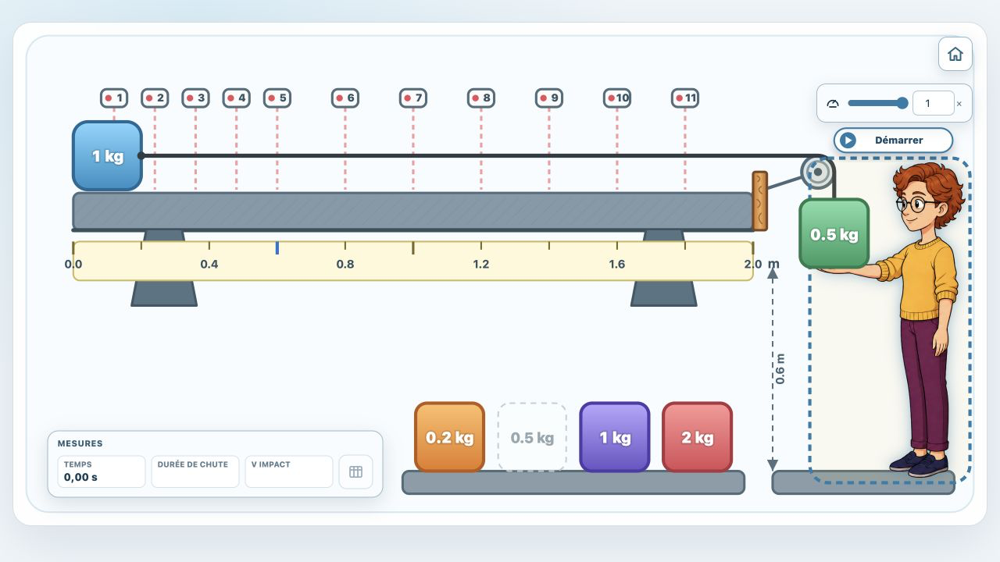

# Horizontal Track Motion Simulation

A standalone, browser-based physics simulation inspired by the interaction principles of PhET. It models a cart moving on a horizontal track while being pulled by a suspended mass through a string and pulley system.

The application is intended for classroom investigation of accelerated motion, motion with friction, measurement uncertainty, repeated experiments, and data analysis. It runs entirely in the browser without a server, external JavaScript library, or network connection.

## Preview



## Features

- Two pedagogical modes: ideal and frictional.
- Animated SVG apparatus with a cart, pulley, string, suspended mass, and speed sensors.
- Four selectable suspended masses available by tap, click, keyboard, or drag and drop.
- Exact event handling for sensor crossings, impact, phase transition, stopping, and track end.
- Perfect measurements in ideal mode.
- Gaussian measurement noise in friction mode.
- On-screen measurement table and CSV export.
- French and English user interfaces.
- Keyboard and pointer interaction.
- A single generated `index.html` file that can be opened directly.

## Quick Start

1. Download or clone the repository.
2. Open [`index.html`](./index.html) in a recent browser.
3. Select the interface language on the landing page. French is selected by default.
4. Choose an exploration mode.
5. Select a suspended mass by tapping or clicking it. Drag and drop remains available on larger screens.
6. Start the simulation with the play control.
7. When the experiment ends, open the measurement table and optionally download the CSV file.

The default suspended mass is `0.5 kg`.

## Mobile Compatibility

The dedicated mobile interface is implemented and documented in [`docs/mobile-interface.md`](./docs/mobile-interface.md). The responsive foundation and original audit remain available in [`docs/responsive-foundation.md`](./docs/responsive-foundation.md) and [`docs/mobile-compatibility-audit.md`](./docs/mobile-compatibility-audit.md).

Current responsive behavior includes:

- a fluid apparatus with no forced mobile width or page-level horizontal scrolling;
- the original `1440 px` maximum simulation width and apparatus composition on desktop;
- a tighter SVG viewport on portrait phones, preserving the physical coordinate system while enlarging the useful scene;
- a dedicated four-button suspended-mass selector on narrow and short-landscape screens;
- direct tap or click selection in addition to drag and drop and keyboard selection;
- readouts placed before the commands on portrait phones;
- a two-column composition on short landscape screens, with the apparatus on the left and controls on the right;
- a card-based measurement presentation below `560 px`, without horizontal table scrolling;
- safe-area-aware spacing, dynamic viewport units, and `44 × 44 px` or larger primary targets;
- automatic SVG recropping after viewport resizing or orientation changes.

The desktop interface is intentionally unchanged: its full SVG mass rack, overlaid controls, and historical `1200 × 620` SVG viewBox remain active on wide screens.

## Languages and Number Formatting

The landing page provides two language choices:

- French, selected by default;
- English.

The language selector is available only before entering a simulation mode. Returning to the landing page with the home button makes the selector available again.

The active language applies to:

- the mode-selection screen;
- command labels, tooltips, and accessible names;
- result readouts;
- the measurement table;
- CSV headers and filenames;
- accessible SVG descriptions.

French readouts, table cells, and CSV numerical values use a comma as the decimal separator, for example `1,23`. French CSV files use semicolons between columns so that decimal commas remain unambiguous.

English readouts, table cells, and CSV numerical values use a decimal point, for example `1.23`, with commas between CSV columns.

## Simulation Modes

| Mode | Friction coefficient | Speed measurement | Time measurement | Learning purpose |
|---|---:|---:|---:|---|
| **Ideal case** | `μ = 0` | perfect | perfect | Identify the two phases of motion and the main physical relationships |
| **Case with friction** | `μ = 0.058` | Gaussian noise, `σ = 0.1 m·s⁻¹` | Gaussian noise, `σ = 0.1 s` | Estimate the unknown friction coefficient through repeated measurements |

The friction coefficient is deliberately hidden from learners in the second mode. Resetting the experiment generates a new independent realization of the measurement noise.

Noisy time and speed measurements are bounded at zero to prevent nonphysical negative values.

## Interaction

### Suspended Mass Selection

Four suspended masses are available:

- `0.2 kg`;
- `0.5 kg`;
- `1 kg`;
- `2 kg`.

Each mass has a distinct color. On desktop, click a mass or drag it from the rack to the suspended position. On smartphones, use the larger mass buttons displayed directly below or beside the apparatus. The previously selected mass automatically returns to its original place. The empty dashed desktop placeholder continues to display its mass value in gray.

Keyboard users can focus a mass and press `Enter` or `Space` to select it.

### Animation Controls

On wide screens, the controls are overlaid in the lower-left area of the apparatus. In portrait at widths up to `760 px`, the readouts, mass selector, and controls form a vertical interface below the SVG. On short landscape screens, the apparatus and command area are arranged in two columns:

- play or resume;
- pause;
- advance by one `0.05 s` step;
- reset;
- playback speed from `0.2×` to `1×` in `0.2×` increments.

The home button in the upper-right corner of the SVG returns to the mode-selection screen.

### Result Readouts

The result area displays:

- current simulation time;
- fall duration;
- impact speed;
- a button that opens the measurement table.

Fall duration and impact speed use the measurement recorded by sensor 5 at `0.60 m`. In friction mode, these displayed values therefore include the configured time and speed measurement noise.

The final-result fields remain visible but disabled and empty until sensor 5 is triggered.

## Fixed Physical Parameters

| Parameter | Value |
|---|---:|
| Cart mass | `1 kg` |
| Cart length | `0.2 m` |
| Drop height | `0.6 m` |
| Track length | `2 m` |
| Gravitational acceleration | `9.81 m·s⁻²` |
| Initial position | `x₀ = 0` |
| Initial speed | `v₀ = 0` |

The cart stops when its right edge reaches the end of the track. Its left edge therefore never moves beyond `1.8 m`.

## Sensor Positions

The eleven sensors are located at:

```text
0.12, 0.24, 0.36, 0.48, 0.60, 0.80,
1.00, 1.20, 1.40, 1.60, and 1.80 m
```

A sensor triggers when the left edge of the cart crosses its beam. It then changes directly to green and records at most one measurement during an experiment.

## Physical Model

The model assumes:

- a massless, inextensible string;
- an ideal pulley with no inertia or friction;
- a horizontal track;
- a constant kinetic-friction coefficient;
- no air resistance;
- equal speeds for the cart and suspended mass during phase 1.

### Phase 1: Suspended Mass Falling

While the suspended mass is falling, the common acceleration is:

```text
a₁ = (m₂g − μm₁g) / (m₁ + m₂)
```

If the driving force is insufficient to overcome friction, the system remains at rest.

### Phase 2: Suspended Mass on the Stop

When the suspended mass reaches the stop, the string becomes slack and no longer pulls the cart:

```text
a₂ = −μg
```

In ideal mode, `a₂ = 0`, so the cart continues at constant speed. In friction mode, the speed decreases until the cart stops or reaches the end of the track.

### Numerical Integration and Events

For constant acceleration over a time interval `Δt`, the engine uses the exact kinematic equations:

```text
x(t + Δt) = x(t) + v(t)Δt + ½aΔt²
v(t + Δt) = v(t) + aΔt
```

The time loop uses a fixed physics step. Phase transition, sensor crossings, friction stopping, and arrival at the track end are located at their exact event times, even when they occur between rendered frames.

## Measurement Table and CSV Export

The table button becomes active when the simulation reaches a terminal state. It opens a modal layer containing four columns:

1. sensor number;
2. sensor position;
3. trigger time;
4. measured speed.

The dialog can be closed with its close button, by selecting the backdrop, or by pressing `Escape`.

A download button in the dialog header exports the same measurements as a UTF-8 CSV file. The filename is:

- `mesures-capteurs.csv` in French;
- `sensor-measurements.csv` in English.

French example:

```csv
"Numéro du capteur";"Position (m)";"Instant de déclenchement (s)";"Vitesse mesurée (m/s)"
1;0,12;0,431628;0,541907
```

English example:

```csv
"Sensor number","Position (m)","Trigger time (s)","Measured speed (m/s)"
1,0.12,0.431628,0.541907
```

Export characteristics:

- one row per triggered sensor;
- rows sorted by sensor number;
- positions expressed in the same coordinate system as the SVG ruler;
- locale-aware decimal notation: comma in French, point in English;
- semicolon-separated columns in French and comma-separated columns in English;
- up to six decimal places;
- UTF-8 byte-order mark for compatibility with common spreadsheet software.

## Keyboard Shortcuts

| Key | Action |
|---|---|
| `Space` | Start, resume, or pause |
| `Right Arrow` | Advance by `0.05 s` |
| `Home` | Reset the experiment |
| `Enter` or `Space` on a mass | Select that suspended mass |
| `Escape` | Close the measurement dialog |

Global shortcuts are ignored while an input or button has focus.

## Project Structure

```text
.
├── index.html                     # Generated standalone application
├── dist-standalone.js             # Generated JavaScript bundle
├── package.json                   # Project metadata and npm scripts
├── README.md                      # Project documentation
├── docs/                          # Preview, mobile audit, responsive stages, measurements, and screenshots
├── LICENSE                        # CC BY 4.0 license and attribution
├── scripts/
│   ├── build-standalone.mjs       # Generates index.html and the bundle
│   └── smoke-standalone.mjs       # Runs a minimal standalone smoke test
├── src/
│   ├── animated-app.js            # Application composition and readouts
│   ├── app-state.js               # Central application state
│   ├── apparatus-animation.js     # Cart, mass, and string animation
│   ├── apparatus-geometry.js      # SVG geometry and physical scales
│   ├── apparatus-view.js          # Static SVG construction and localization
│   ├── apparatus.css              # Layout and visual presentation
│   ├── constants.js               # Fixed parameters and simulation modes
│   ├── i18n.js                    # Translations and locale-aware formatting
│   ├── language-selector.js       # Landing-page language selector
│   ├── mass-selector.js           # SVG tap, keyboard, and drag-and-drop selection
│   ├── mobile-mass-selector.js    # Large touch-oriented mass buttons
│   ├── measurement-export.js      # Measurement dialog and CSV export
│   ├── measurement-recorder.js    # Sensor values and measurement noise
│   ├── mode-selector.js           # Mode-selection screen
│   ├── parameter-controls.js      # Playback-speed setting
│   ├── responsive-apparatus.js    # Portrait and short-landscape SVG viewport
│   ├── physics.js                 # Core physical functions
│   ├── sensor-controller.js       # Sensor-crossing detection and display
│   ├── simulation-controls.js     # Controls and keyboard shortcuts
│   ├── time-loop.js               # Fixed-step time loop
│   └── transitions.js             # Exact event transitions
└── test/                          # Unit and integration tests
```

`index.html` and `dist-standalone.js` are generated files. Functional changes should be made in `src/` or the standalone build script, followed by a rebuild.

## Development

### Requirements

- Node.js 18 or later;
- Python 3 only when using the optional local server command.

The project has no third-party npm runtime dependencies.

### Commands

Run the test suite:

```bash
npm test
```

Build the standalone application:

```bash
npm run build
```

Run the standalone smoke test:

```bash
npm run smoke
```

Serve the project locally:

```bash
npm run serve
```

Then open `http://localhost:8000`.

Opening `index.html` directly with a `file://` URL is also supported.

## Accessibility

The application includes:

- keyboard-operable controls and mass selection;
- accessible names for icon-only buttons;
- translated SVG titles and descriptions;
- visible focus indicators;
- table-based access to every exported measurement;
- color changes that are supplemented by structural and textual states;
- support for reduced-motion preferences where applicable.

## Scientific Scope and Limitations

This is an educational model rather than a complete representation of a laboratory apparatus. It does not include:

- pulley inertia;
- pulley friction;
- string elasticity or mass;
- air resistance;
- variable friction;
- track inclination;
- deformation or collision dynamics at the stop.

Measurement noise is generated from independent normal distributions. It represents a controlled pedagogical uncertainty model, not a calibration model for a particular physical sensor.

## Testing

The automated suite covers:

- physical equations and parameter validation;
- exact phase and stopping events;
- fixed-step timing behavior;
- SVG geometry and animation;
- sensor positions and crossings;
- tap, click, drag-and-drop, keyboard, and mobile-button mass selection;
- noisy time and speed measurements;
- central state transitions;
- mode selection;
- bilingual localization and decimal formatting;
- measurement table and CSV export;
- standalone bundle generation.

## Contributing

Contributions should preserve:

- scientific consistency between the physical engine, animation, and exported data;
- offline operation of the generated page;
- keyboard accessibility;
- both French and English translations;
- automated tests for changed behavior.

Recommended workflow:

1. create a focused branch;
2. make source changes;
3. add or update tests;
4. run `npm test`;
5. run `npm run build`;
6. run `npm run smoke`;
7. submit a pull request describing the scientific and interface effects.

## License and Attribution

This project is licensed under the **Creative Commons Attribution 4.0 International License (CC BY 4.0)**.

Required attribution:

> Jean-Francois Parmentier, IPSA, IRIT

See [`LICENSE`](./LICENSE) for the full license notice and attribution requirements.
