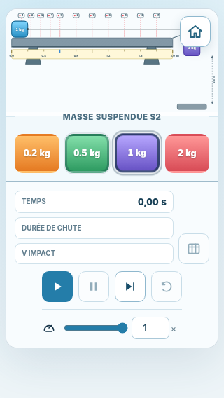
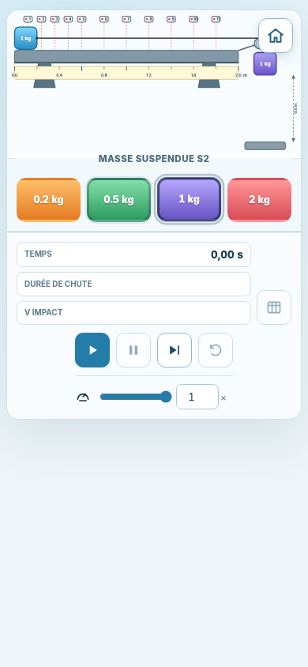
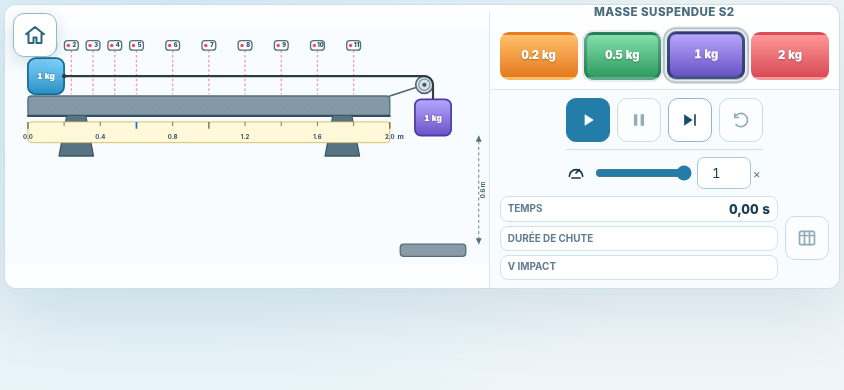
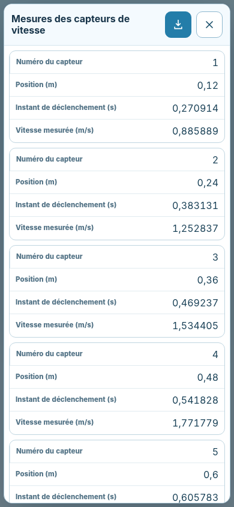

# Mobile Interface

## Status

**Implementation date:** 23 July 2026  
**Stage:** dedicated mobile interface  
**Scope:** portrait and short-landscape compositions, touch-oriented suspended-mass selection, responsive SVG framing, and narrow-screen measurement cards.

This stage builds on the responsive foundation without changing the physical model, sensor positions, event timing, desktop geometry, or standalone single-file deployment.

## Implemented Changes

### Portrait-phone composition

At widths up to `760 px` in portrait orientation:

- the useful SVG scene is framed with a tighter viewBox (`70 60 1100 535`);
- the SVG mass rack is replaced by four large HTML mass buttons;
- the selected mass is indicated with `aria-pressed` and a strong visible outline;
- the result readouts are placed before the simulation commands;
- the controls remain below the experimental setup;
- no page-level horizontal scrolling is introduced.

The tighter viewBox changes only the visible SVG window. The apparatus coordinates and physical pixel-per-metre scale used by the animation remain unchanged.

### Short-landscape composition

For landscape viewports no higher than `500 px` and no wider than `1000 px`:

- the apparatus occupies the left column;
- suspended-mass buttons and controls occupy the right column;
- the home button moves to the upper-left corner of the apparatus;
- the SVG uses a short-landscape viewBox (`45 55 1120 545`);
- the miniature SVG mass rack is hidden;
- the complete interface fits within a typical phone landscape viewport without horizontal overflow.

### Direct mass selection

Suspended masses can now be selected through four equivalent methods:

- tap or click a mass in the SVG;
- drag a mass to the suspended position;
- press `Enter` or `Space` on a focused SVG mass;
- tap or click one of the large mobile mass buttons.

A movement threshold distinguishes a tap from a drag. A brief press selects directly, while a deliberate movement preserves drag-and-drop behavior.

### Narrow-screen measurement results

Below `560 px`, the measurement table is presented as a list of cards:

- the conventional table header is hidden visually;
- every value retains its localized column label through a `data-label` attribute;
- all four values remain visible for each sensor;
- the dialog uses the available dynamic viewport height;
- no horizontal scrolling is required;
- CSV download remains available in the dialog header.

### Desktop preservation

Above the mobile breakpoints:

- the original `1200 × 620` SVG viewBox is retained;
- the full SVG mass rack remains visible;
- the control panel remains overlaid in the lower-left apparatus area;
- the maximum desktop page width remains `1440 px`.

## Verification Results

The final standalone page was rendered with Chromium at the following viewports:

| Profile | Viewport | Layout | SVG viewBox | Horizontal overflow |
|---|---:|---|---|---|
| Small phone, portrait | `320 × 568` | Mobile portrait | `70 60 1100 535` | None |
| Phone, portrait | `390 × 844` | Mobile portrait | `70 60 1100 535` | None |
| Phone, landscape | `844 × 390` | Short landscape | `45 55 1120 545` | None |
| Desktop reference | `1440 × 900` | Desktop | `0 0 1200 620` | None |

The touch-oriented `1 kg` button was exercised in each mobile profile. Its `aria-pressed` state changed to `true`, and the suspended SVG mass was rebuilt with the selected value.

The measurement dialog was also validated at `390 × 844 px`:

- all `11` sensor records were displayed;
- the dialog width was `378 px`;
- its scroll container width and content width were both `376 px`;
- no horizontal overflow occurred;
- French decimal commas and localized row labels were retained.

Raw measurements are stored in [`mobile-interface-results.json`](./mobile-interface-results.json).

## Reference Screenshots

### Small phone, portrait

### Phone, portrait

### Phone, landscape

### Measurement cards on a phone

### Desktop reference

## Automated Validation

- `234` automated tests pass.
- The standalone smoke test passes.
- The generated `index.html` remains self-contained.
- Desktop physical geometry and event behavior remain unchanged.
