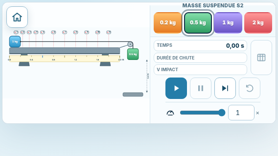
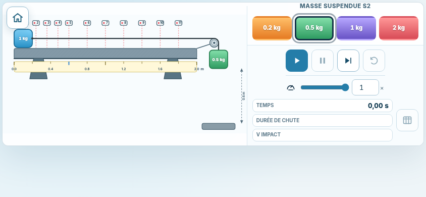
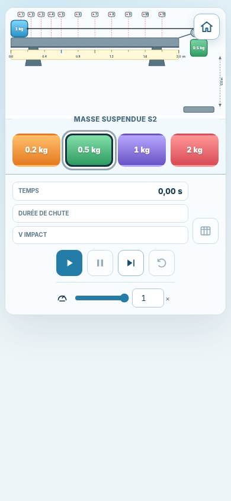
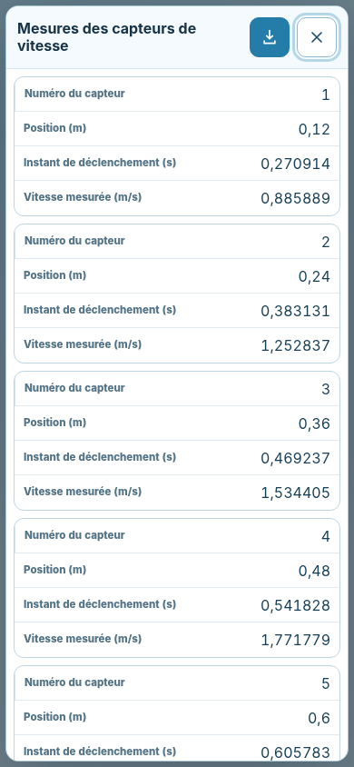
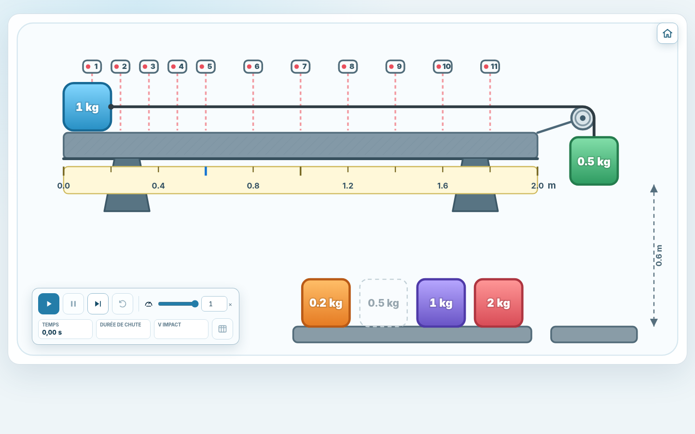

# Mobile Robustness

## Status

**Implementation date:** 23 July 2026  
**Stage:** mobile robustness and accessibility  
**Scope:** orientation changes, very short landscape screens, keyboard focus, modal behavior, motion preferences, high-contrast operation, and regression testing.

This stage strengthens the responsive interface introduced in the previous stages. It does not modify the physical model, apparatus coordinates, sensor positions, numerical integration, measurement noise, CSV data, or desktop apparatus composition.

## Implemented Changes

### Orientation and viewport robustness

The SVG viewport controller now reacts to:

- ordinary window resizing;
- legacy `orientationchange` events;
- Screen Orientation API `change` events;
- Visual Viewport resizing;
- page restoration through `pageshow`.

The current viewport width and height are recorded on the SVG as diagnostic data attributes. A live rotation from `390 × 844 px` portrait to `844 × 390 px` landscape changes the layout from `mobile-portrait` to `short-landscape` and applies the corresponding SVG viewBox without rebuilding or changing the physical geometry.

For very short landscape screens up to `760 px` wide and `360 px` high, the right-hand command column is compacted while keeping every primary target at least `44 × 44 px`. The complete simulation fits in a `568 × 320 px` viewport without horizontal or vertical page scrolling.

### Focus continuity between screens

After a mode is selected, keyboard focus moves to the start button. Returning to the landing page restores focus to the mode card that opened the simulation. The hidden screen is also marked inert, in addition to being hidden and excluded from the accessibility tree.

On phone layouts, the overlaid home button is hidden in portrait and landscape orientations. This prevents the control from covering the apparatus or interfering with browser-edge gestures; the control remains unchanged on larger-screen layouts.

A keyboard-visible skip link provides direct access to the main content.

### Accessible simulation status

A visually hidden `role="status"` region announces the principal state changes:

- ready;
- running;
- paused;
- complete;
- blocked by insufficient driving force.

The status text is localized in French and English and does not add a visible status line to the interface.

### Modal measurement table

The measurement table now behaves as a complete modal dialog:

- focus is moved to the close action when the dialog opens;
- `Tab` and `Shift+Tab` remain inside the dialog;
- `Escape` closes the dialog;
- the apparatus is inert and hidden from assistive technologies while the dialog is open;
- page scrolling is locked while the dialog is displayed;
- focus returns to the table button after closing;
- an accessible description explains the available keyboard actions.

The existing CSV download and eleven localized measurement records are unchanged.

### Motion and contrast preferences

When `prefers-reduced-motion: reduce` is active, decorative transitions and CSS animations are reduced to an effectively instantaneous duration. The physical movement itself remains available because it conveys the scientific behavior of the system rather than serving as decoration.

A `forced-colors` media query preserves focus outlines, selected mass states, and triggered-sensor states in operating-system high-contrast modes.

## Browser Validation

The generated standalone page was exercised with headless Chromium using the complete inline `index.html` file.

| Profile | Viewport | Layout | Page overflow | Minimum primary target |
|---|---:|---|---|---:|
| Very short phone, landscape | `568 × 320` | `short-landscape` | None | `44 px` |
| Phone, landscape | `844 × 390` | `short-landscape` | None | `44 px` |
| Phone, portrait | `390 × 844` | `mobile-portrait` | None | `44 px` |
| Desktop reference | `1440 × 900` | `desktop` | None | `44 px` |

Additional checks confirmed:

- focus reaches the start control after mode selection in every profile;
- a live portrait-to-landscape resize updates the SVG layout and viewBox;
- the modal displays all `11` measurement rows;
- the modal locks the page, makes the apparatus inert, traps focus, closes with `Escape`, and restores focus;
- reduced-motion and forced-colors media queries are detected by the browser.

Raw browser measurements are stored in [`mobile-robustness-results.json`](./mobile-robustness-results.json).

## Reference Screenshots

### Very short landscape phone

### Standard landscape phone

### Portrait phone

### Modal measurement records

### Desktop reference

## Automated Validation

- `242` automated tests pass.
- The standalone smoke test passes.
- The generated `index.html` remains self-contained.
- The desktop `1200 × 620` SVG viewBox and `1440 px` maximum interface width remain unchanged.
- The physical equations, exact event handling, sensor data, and CSV formatting remain unchanged.
