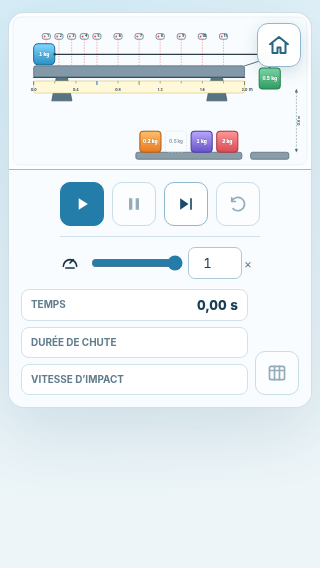
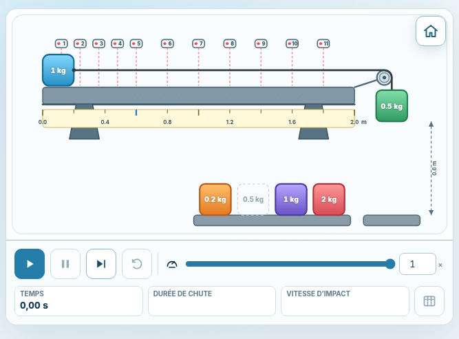
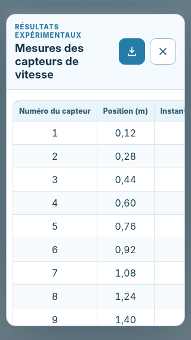

# Responsive Foundation

## Status

**Implementation date:** 23 July 2026  
**Stage:** responsive structure  
**Scope:** viewport behavior, fluid apparatus sizing, control reflow, safe-area spacing, dynamic viewport units, minimum command targets, and mode-transition scrolling.

This stage removes the structural blockers identified by the mobile compatibility audit while preserving the desktop layout, the physical coordinate system, and the standalone single-file build.

## Implemented Changes

### Fluid page and apparatus

- The page shell uses a fluid `100%` width while preserving the original `1440 px` maximum content width on desktop.
- The forced `900 px` minimum width below `760 px` has been removed.
- The apparatus card, stage, host, and SVG explicitly use `max-width: 100%` and `min-width: 0`.
- The apparatus SVG keeps its original `1200 × 620` viewBox and physical geometry while scaling to the available width.
- Page-level horizontal overflow is clipped as a final safeguard.

### Responsive controls

- Above `760 px`, the control panel retains its desktop overlay position.
- At `760 px` and below, the panel enters the normal document flow below the SVG.
- At `520 px` and below, the four main commands occupy the first row and the playback control occupies a second full-width row.
- Readouts stack vertically on narrow portrait screens and remain in a row when more width is available.
- The playback range is fluid rather than fixed at `76 px`.

### Mobile viewport handling

- The viewport declaration now includes `viewport-fit=cover`.
- Safe-area inset variables are used for page padding and fixed corner controls.
- `dvh` is used, with `vh` fallbacks, for full-height screens and the measurement dialog.
- Entering a simulation mode or returning home resets the viewport to the top of the page.

### Touch-size foundation

The following controls now have a minimum rendered size of `44 × 44 px`:

- play, pause, step, reset, and measurement-table buttons;
- home button;
- project-information button;
- measurement-dialog download and close buttons.

Tap-to-select for suspended masses is intentionally deferred to the next interaction stage.

## Verification Results

The generated standalone page was rendered with Chromium at the following viewports:

| Profile | Viewport | Document width | Horizontal overflow | Control position |
|---|---:|---:|---|---|
| Small phone, portrait | `320 × 568` | `320 px` | None | Below SVG |
| Phone, portrait | `375 × 667` | `375 px` | None | Below SVG |
| Large phone, portrait | `430 × 932` | `430 px` | None | Below SVG |
| Phone, landscape | `667 × 375` | `667 px` | None | Below SVG |
| Large phone, landscape | `932 × 430` | `932 px` | None | Desktop overlay |
| Tablet, portrait | `768 × 1024` | `768 px` | None | Desktop overlay |
| Desktop reference | `1440 × 900` | `1440 px` | None | Desktop overlay |

The raw measurements are stored in [`responsive-foundation-results.json`](./responsive-foundation-results.json). Measurement-dialog checks are stored in [`responsive-dialog-results.json`](./responsive-dialog-results.json).

## Reference Screenshots

### Small phone, portrait

### Phone, landscape

### Measurement table on a small phone

## Automated Validation

- `224` automated tests pass.
- The standalone smoke test passes.
- The generated `index.html` remains self-contained.
- Desktop apparatus geometry and event behavior remain unchanged.
- The desktop content width was restored to its original `1440 px` maximum after responsive validation.

## Remaining Mobile Work

The structural responsive stage does not complete the full smartphone roadmap. The next stages should address:

- a dedicated mobile apparatus composition with larger experimental objects;
- tap-to-select as an alternative to mass drag and drop;
- short-landscape and orientation-specific refinements;
- more compact measurement-table headers or an alternative narrow-screen presentation;
- enlarged-text and real-device testing.
